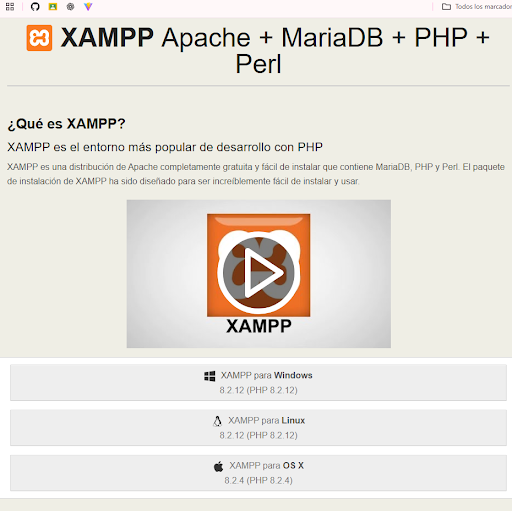
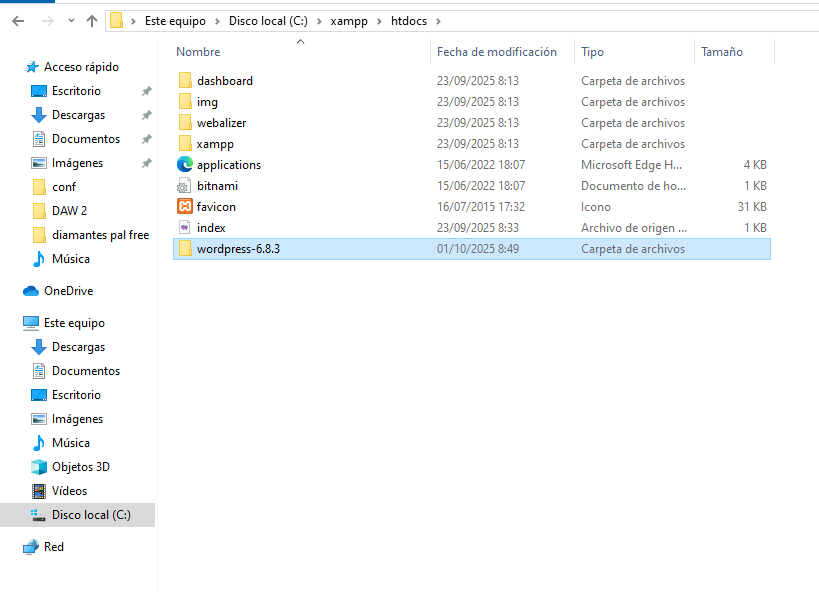
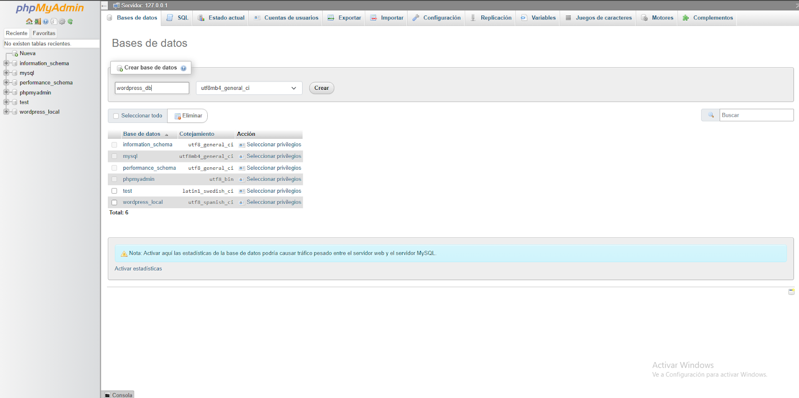
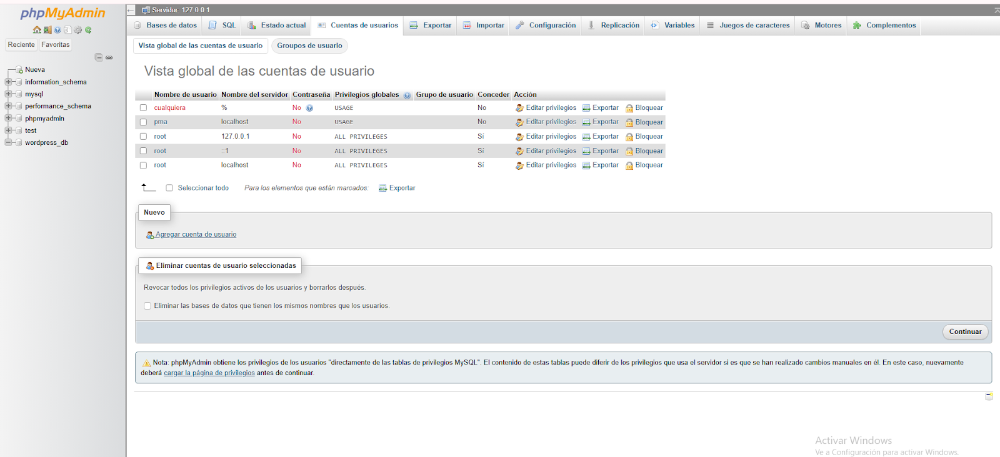
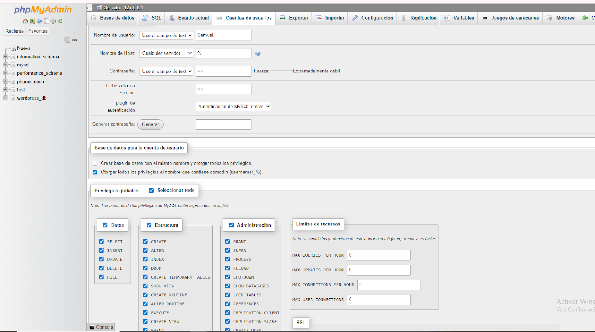
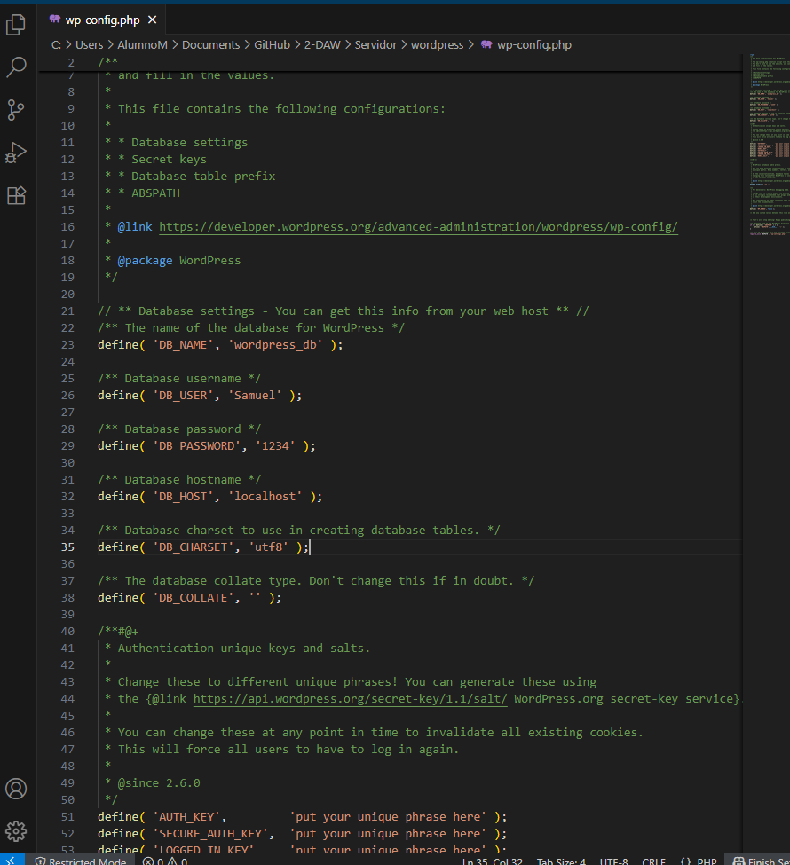

Grupo:
Javi Casado
Samuel Añino
Victoria Segovia

# INSTALACION DE WORDPRESS CON XAMPP (EN LOCAL)

## ¿QUÉ ES XAMPP?

XAMPP es un paquete de software libre que facilita la instalación de un servidor web local en tu computadora. Su nombre proviene de las iniciales de los programas que incluye: X (multiplataforma), Apache (servidor web), MySQL/MariaDB (gestor de bases de datos), PHP y Perl (lenguajes de programación). 

Gracias a esta combinación, XAMPP permite a los desarrolladores y estudiantes crear, probar y ejecutar sitios web o aplicaciones dinámicas de manera sencilla, sin necesidad de contar con un servidor en línea. Además, es muy utilizado en entornos de aprendizaje porque es gratuito, fácil de instalar y compatible con Windows, Linux y macOS.

1. Instalar XAMPP Descarga XAMPP desde la página oficial : https://www.apachefriends.org/es/index.html 

2. Instálalo (elige las opciones por defecto si no sabes qué marcar).

3. Abre el Panel de Control de XAMPP y activa:
    - Apache (servidor web).
    - MySQL (base de datos).

## PASO A PASO PARA INSTALAR WORDPRESS

1. Descargar WordPress
    - Ve a la web oficial: [WORDPRESS](https://es.wordpress.org/download descarga el wordpress e instalarlo. 
    

2. Descomprimir Archivo WordPress
    

3. Copiar la carpeta descomprimida de WordPress en: C:\xampp\htdocs
    - Opcional: si ya tenías instalado el xampp con una dirección diferente, entonces copia la carpeta de wordpress en esa dirección.
    

4. En tu navegador abre: https:/localhost/phpadmin
    - Clica en la pestaña “Nueva” en el menu de la izquierda para crear una nueva base de datos.
    
    - Escribe el nombre de la base de datos. Ejemplo: wordpress_db
    

5. Crea un nuevo usuario con privilegios totales:
    - Clica en servidor 127.0.0.1 en la pestaña superior.
    - Clica en “Agregar cuenta de usuarios”
    

6. Añade un nuevo usuario completando los campos:
	- Nombre de usuario: Samuel
	- Contraseña: 1234 (o la que prefieras)

    Clica en “Otorgar todos los privilegios al nombre que contiene…”
    Clica en "privilegios globales" => "Seleccionar todo".
    Clica en "continuar" para guardar los cambios.
     

7. Clica en la pestaña de privilegios para comprobar que el usuario (Samuel, en este caso) se ha creado.
    

8. Abre la carpeta de WordPress (C:\xampp\htdocs):
    - Cambia el nombre del archivo “wp-config-sample.php” a “wp-config.php”

9. Abre el archivo “wp-config.php” y cambia los siguientes campos:
    - define(‘DB_NAME’, ‘wordprass_db’ )
    - define(‘DB_USER’, ‘Samuel’)
    - define(‘DB_PASSWORD’, ‘1234’)

    Rellena con los datos que hayas introducido.
    

10. Abrimos en navegador: https://localhost/wordpress/

11. Selecciona el idioma deseado y dale a continuar.
    

12. Rellena los campos de wordpress con la informacion de usuario que desees:
    Es importante que rellenes con tu correo electronico.
    dale a continuar para finalizar la creacion de tu página wordpress.
    

13. Rellena con tus datos de usuario recién creados y…
    

14. Clica en acceder para ver tu nuevo espacio de wordpress🎉.
    

